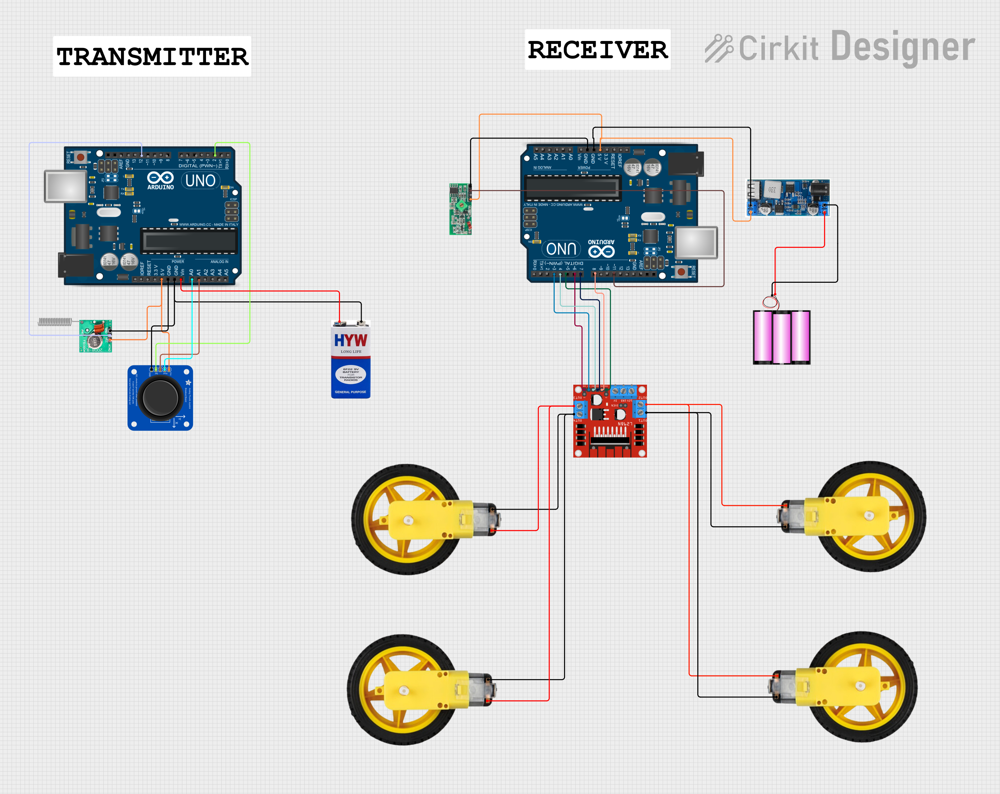
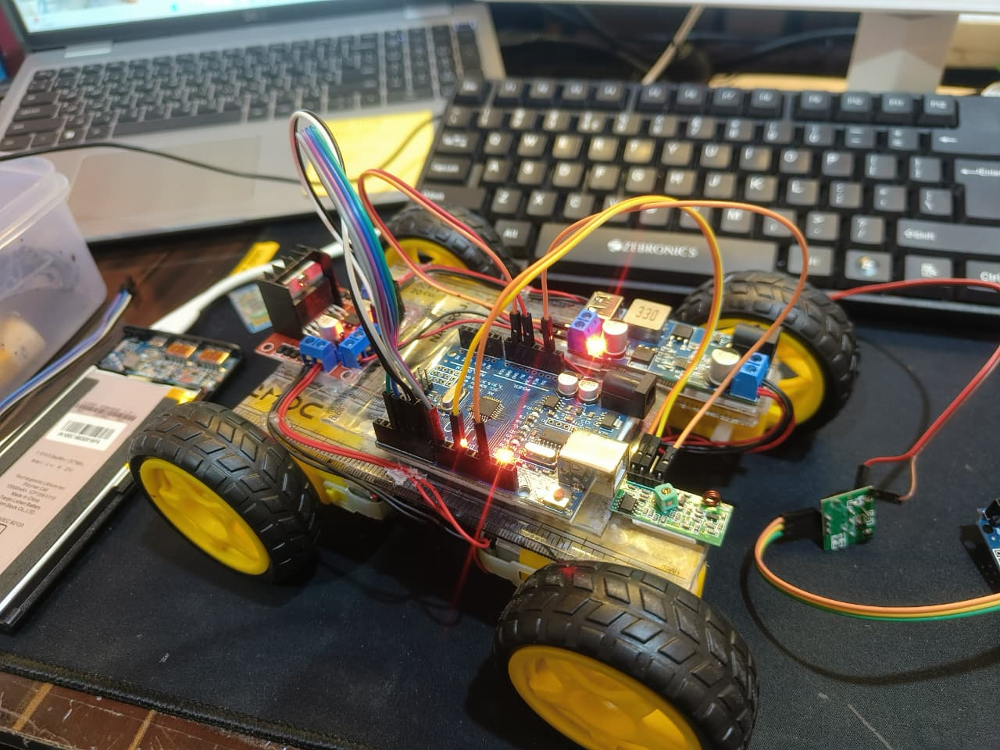
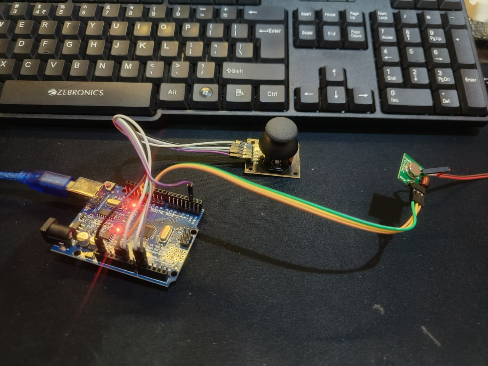

# RF_rc_car — Arduino 433 MHz RC Car (UNO ×2, FS1000A, L298N)

A beginner-friendly, *teach-by-building* DIY RC car. The transmitter UNO reads a 2-axis joystick (with push-switch) and sends compact 433 MHz packets via an **FS1000A**. The receiver UNO decodes them and drives 4 DC gear motors through an **L298N** dual H-bridge with smooth ramping, dead-zone, failsafe, and optional braking at zero.

> **Highlights**
> - Clean repo layout with ready-to-flash firmware
> - Differential (tank) steering mix: `left = THR + STR`, `right = THR − STR`
> - Failsafe (stop/brake on RF loss), slew-rate ramping, min-start-PWM
> - Easy inversion flags for throttle/steer and each motor side
> - Clear wiring tables and quick-start flow

---

## What you’ll build

**TX (Handheld remote)**  
Joystick → UNO (reads X/Y/SW) → FS1000A 433 MHz → *over-the-air packets*

**RX (On-car)**  
433 MHz receiver → UNO (decodes joystick) → L298N → 4× DC motors

  
*(Add your PNG circuit diagram here)*

---

## Bill of Materials (BOM)

| Qty | Item | Notes |
|---:|---|---|
| 2 | Arduino **UNO** | One for TX, one for RX |
| 1 | **FS1000A** 433 MHz TX | Transmitter module (3 pins: DATA, VCC, GND) |
| 1 | 433 MHz **ASK/OOK receiver** | e.g., XY-MK-5V/MX-RM-5V/SRX882 (4 pins: GND, DATA, DATA, VCC) |
| 1 | **L298N** dual H-bridge module | Remove ENA/ENB jumpers to use PWM |
| 4 | DC gear motors | “Toy” car motors are fine |
| 1 | **Joystick** module (2-axis + SW) | VRx, VRy, SW pins |
| 1 | **12 V** battery pack (Li-ion) | Motors supply (not the UNO) |
| 1 | **5 V buck** converter (≥2 A recommended) | Powers UNO + RF on the car |
| — | Wires, breadboard, headers | |
| — | **Caps**: 0.1 µF ceramics, 470–1000 µF electrolytics | Noise suppression & bulk |
| — | **Antennas**: ~17.3 cm wire ×2 | ¼-wave for 433 MHz (TX & RX) |

> Capacity (mAh) ≠ current capability. For fewer brownouts, use decent cells or an RC LiPo with adequate C-rating.

---

## Tooling & Libraries

- **Arduino IDE** (1.8.x or 2.x)
- **RadioHead** library (RH_ASK) — install via **Library Manager**:
  - *Sketch → Include Library → Manage Libraries…* → search **“RadioHead”** → Install

---

## Wiring

### Transmitter (UNO + Joystick + FS1000A)

**Joystick → UNO**
- VCC → **5V**
- GND → **GND**
- VRx → **A0** (steer)
- VRy → **A1** (throttle)
- SW  → **D2** (uses `INPUT_PULLUP`, pressed = LOW)

**FS1000A → UNO**
- DATA → **D12**
- VCC  → **5V**
- GND  → **GND**
- ANT  → *optional 17.3 cm wire*

> Power from USB for bench tests. Keep TX at least 30 cm from RX to avoid front-end overload.

---

### Receiver (UNO + 433 MHz RX + L298N + Motors)

**433 MHz RX module → UNO**
- DATA → **D11**
- VCC  → **5V** (buck)
- GND  → **GND**
- ANT  → *optional 17.3 cm wire*

**UNO → L298N (logic)**
- ENA → **D5** (PWM) ← *remove ENA jumper*
- IN1 → **D8**
- IN2 → **D7**
- ENB → **D6** (PWM) ← *remove ENB jumper*
- IN3 → **D4**
- IN4 → **D3**

**Power / Motors**
- **Battery +12V → L298N +12V**
- **Battery − → L298N GND**
- **Buck 5V → UNO 5V** (and RX module)
- **Common ground**: Tie UNO GND, L298N GND, buck GND together (star point)
- **Left motors (pair)** → L298N OUT1/OUT2
- **Right motors (pair)** → L298N OUT3/OUT4

> Add **≥1000 µF** across L298N +12V/GND and **0.1 µF** close to each module’s VCC/GND. Twist each motor’s two wires.

---

## Quick Start (5 minutes)

1. **Clone** this repo.
2. Install **RadioHead** library.
3. Open **`firmware/transmitter/tx_joystick_433mhz.ino`** → select **Arduino Uno** → **Upload** (TX UNO).
4. Open **`firmware/receiver/rx_l298n_diffdrive.ino`** → **Upload** (RX UNO).
5. Wire exactly as above. **Lift the wheels** for first power-on.
6. Open Serial Monitor (RX UNO) at **115200** to watch telemetry.
7. Push joystick **forward** → both sides forward; **left/right** → differential steering.
8. Turn off TX or cover its antenna: after ~300 ms, car coasts to zero; after ~0.9 s, it **brakes** at zero (failsafe).

---

## Calibration & Tuning

Open the RX sketch and adjust:

| Setting | Default | Purpose |
|---|---:|---|
| `INVERT_Y` | `true` | Make stick **forward = forward** (flip if needed) |
| `INVERT_X` | `false` | Flip steering direction |
| `INVERT_LEFT/RIGHT` | `false/false` | Flip each motor side without rewiring |
| `DEADZONE` | `30` | Ignore small joystick jitter near center |
| `MIN_START_PWM` | `45` | Kick motors from standstill (raise if they buzz) |
| `RAMP_STEP` | `6` | Slew-rate per tick (lower = softer starts) |
| `FAILSAFE_MS` | `300` | Stop if no packets for this long |
| `BRAKE_AFTER_MS` | `900` | After idle, actively brake at zero |
| RH_ASK bitrate | `2000` | Change both TX/RX to `1000` for more robustness |

**Antenna tip:** ¼-wave wire **~17.3 cm** vertical on both TX & RX improves range a lot. Adding a **17.3 cm ground counterpoise** helps too.

---

## Troubleshooting

- **Upload error (COM)**: close Serial Monitor, pick correct COM port, check data-capable USB cable.
- **No RF data / short range**: add 17.3 cm antennas, lower bitrate to `1000`, separate TX/RX ≥30 cm, decouple RX power.
- **Wrong motor direction**: flip `INVERT_*` flags or swap that side’s motor leads.
- **Reboots/brownouts**: improve battery current capability, add bulk caps, separate logic (5V buck) from motor supply, twist motor wires, keep RX/antenna away from L298N.

---

## How it works

- **TX** builds a compact `JoyPacket { x, y, sw }` (5 bytes) at ~20 Hz and sends via **RadioHead RH_ASK** at 2 kbps.
- **RX** decodes, maps to percentages with dead-zone & inversion, mixes **differential drive**, and ramps PWM to the L298N. If packets stop arriving, the **failsafe** commands zero and then brakes.

---

## Roadmap / Extensions

- Exponential throttle/steer curves  
- Dual-rate toggle on joystick **SW**  
- Battery monitor & buzzer  
- Telemetry back to TX (RSSI, battery)  
- Upgrade H-bridge (TB6612FNG / BTS7960)  
- Upgrade RF (nRF24L01+, HC-12) for longer range

---

## Media

  

*(Replace with your photos; keep resolutions reasonable for GitHub.)*

---

## License

**MIT License** — free for personal and commercial use, with attribution. See [LICENSE](LICENSE).
